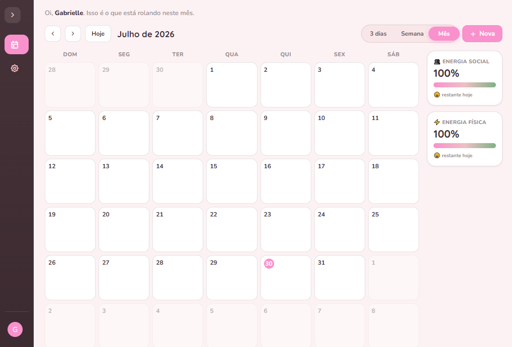

# ⚡ Plannergy

<div align="center">

### I built this for someone I love.

A small, gentle planning tool I made for my autistic girlfriend, because she often overworks herself, forgets to rest, and pushes through her energy until she’s completely drained.

Plannergy is my way of helping her see that her wellbeing matters more than productivity.



</div>

---

## 💛 Why I made this

My girlfriend experiences things differently.

She cares deeply, works hard, and often gives more of herself than she has to give. Like many autistic people, she can hyperfocus, overcommit, and forget to notice when she’s running on empty.

I didn’t want another productivity app.

I wanted something that would gently say:

> “Maybe its time to stop.”

So I built Plannergy not as a tool for doing more, but as a reminder to do less when needed.

---

# 🌿 What Plannergy is

Plannergy is a simple calendar that doesn’t just track time.

It tracks **energy**.

Because time isn’t the limit for everyone.

---

## ⚡ The idea

Every day, you start with:

* 💛 Physical energy
* 🧠 Social energy

Each task you add takes a little of that energy away.

And some tasks, like resting, watching something comforting, or doing nothing at all can give it back.

It’s a small system, but it changes the way you look at your day.

---

# 🌸 Features

## 📅 A soft calendar

* Month, week, and 3-day views
* Simple, quiet layout less pressure, no noise

## ⚡ Energy that feels human

* Two energy types:

  * Physical (your body)
  * Social (your emotional capacity)
* Every task “costs” energy
* Rest tasks *restore* it instead of taking it away
* You can see your energy before you commit to anything

## 🧠 Simple task system

* Tasks and events
* Priorities
* Subtasks for breaking things down
* Notes for thoughts you don’t want to forget
* A “done” state that feels like relief

## 🌙 Gentle design

* Soft colors, no harsh contrast
* Smooth transitions
* A sidebar that quietly gets out of your way
* Everything designed to feel calm (and obviously pink)

## 💾 Everything stays with you

* No accounts
* No cloud
* No tracking
* Everything is saved locally in the browser, as it was meant firstly to be only for the rainmeter app

---

# 🧠 How it works (under the hood)

I built everything from scratch using only:

* HTML
* CSS
* JavaScript

No frameworks. No libraries. Just the browser.

---

# 🌷 What makes it special to me

This isn’t a startup idea.

It’s not trying to scale.

It’s not trying to optimize anything.

It’s just a small digital space I made for someone I love, so she can look at her day and have a piece of myself by her side

---

# 🚀 How to use it

There’s nothing to install.

Just open html!

Also, heres the github pages for it:

[](https://rafaellasantosmd.github.io/Plannergy/)


That’s it.

No setup. No accounts. No friction.

---

# 🌙 Project structure

```
index.html
```

Everything lives in a single file. its simple, contained, and easy to open anytime.

---

# 💭 My hopes for the project

I don’t expect this to change the world or make my any amount of money.

But if it helps her, even a little bit

If it helps her rest

And if it makes her feel less like she has to constantly push herself

Then it did exactly what I built it for!

---

# 🤍 License

MIT

---

<div align="center">

Made with a lot of care and a bit of worry for the love of my life.

</div>
